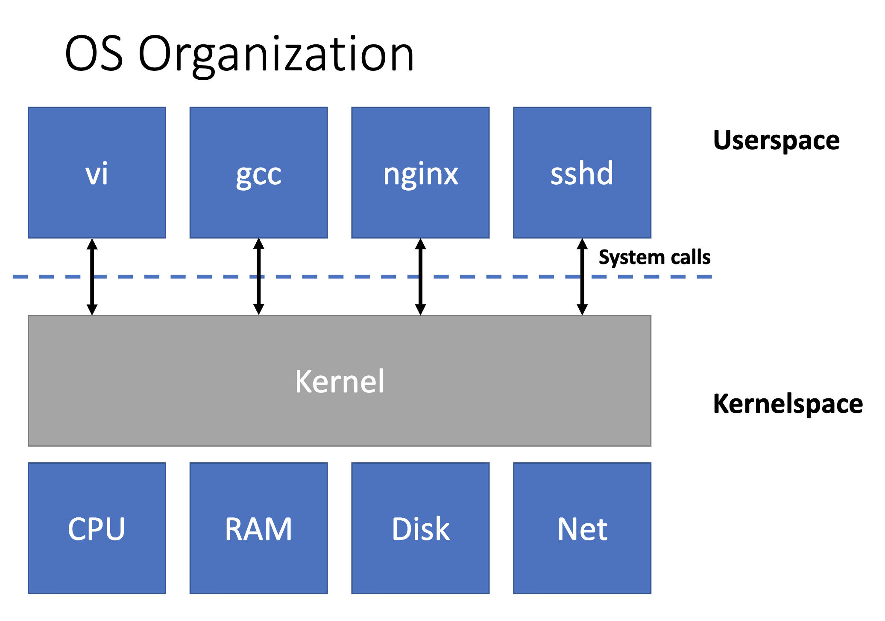
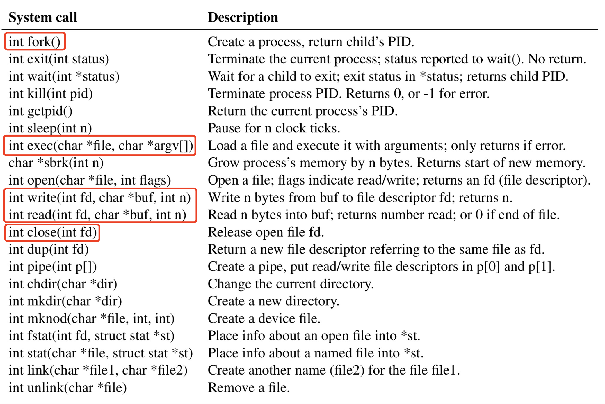

## 什么是系统调用

  操作系统接口，由操作系统实现，供用户程序调用。

## 为什么要使用系统调用/操作系统的目的
  - 抽象
    - 隐藏硬件细节以提高便携性和便利性
    - 不得妨碍高性能
    - 必须支持广泛的应用程序
  - 复用
    - 允许多个应用程序共享硬件
    - 隔离以包含错误并提供安全性
    - 共享以允许程序协作
  - ···

  例子：往列表里append数据时（即在一段内存空间中写连续数据），不会覆盖到其他程序的内存。我在使用打印机打印报销单时，面试官在打印候选人简历，我的报销单不会出现教育经历。

## 系统调用提供了分层结构



## 操作系统为我们实现了什么
- Process（一个正在运行的程序）
- 内存分配
- 文件描述符
- 文件名和目录
- 访问控制和配额
- 许多其他：用户、IPC、网络套接字、时间等。

## 常见的系统调用与例子。



``` python
if __name__ == "__main__":
    with open("./syscall.md", "r") as fd:
        print(fd.read())
```


## 系统调用源码
注：xv6内核源码，基于RISC-V精简指令集。

用户空间 -> sys_getpid()
``` c
uint64 sys_getpid(void)
{
  return myproc()->pid;
}
```
sys_getpid() -> myproc()

``` c
struct proc* myproc(void)
{
  push_off();
  struct cpu *c = mycpu();
  struct proc *p = c->proc;
  pop_off();
  return p;
}
```
myproc() -> mycpu()
``` c
struct cpu* mycpu(void)
{
  int id = cpuid();
  struct cpu *c = &cpus[id];
  return c;
}
```
mycpu() -> cpuid()
``` c
int cpuid()
{
  int id = r_tp();
  return id;
}
```
cpuid() -> r_tp()
``` c
static inline uint64 r_tp()
{
  uint64 x;
  asm volatile("mv %0, tp" : "=r"(x));  // 内嵌汇编
  return x;
}
```
r_tp() -> 汇编读寄存器

1.用户空间->汇编读寄存器，系统调用封装了硬件。
2.struct cpu， struct proc，struct cpu cpus[num_of_core]，内核抽象了硬件。
``` c
struct cpu {
  struct proc *proc;          // 当前进程
  struct context context;     // swtch() here to enter scheduler().
  int noff;                   // Depth of push_off() nesting.
  int intena;                 // Were interrupts enabled before push_off()?
};

extern struct cpu cpus[NCPU];  //所有cpu的列表

struct proc {
  ···
  enum procstate state;        // 进程状态
  int pid;                     // 进程id
  struct proc *parent;         // Parent process
  ···
  uint64 kstack;               // 栈
  pagetable_t pagetable;       // 页表
  struct file *ofile[NOFILE];  // 文件描述符
  ···
};
```

## 高度抽象、通用 
操作系统提供的系统调用接口，形式简单，但实现了便携性、隐藏了硬件，且支持广泛的应用程序。
### 文件描述符
文件描述符是一个小整数（0，1，2），表示进程可以读取或写入的内核管理对象。

进程可以通过打开文件、目录或设备，或通过创建管道，或通过复制现有描述符来获取文件描述符。

尽管往我们把文件描述符叫做“文件”，文件描述符还可以描述硬件、pipes，使它们看起来都像字节流。

按照惯例，进程从文件描述符 0（标准输入流）读取，将输出写入文件描述符 1（标准输出流），并将错误消息写入文件描述符 2（标准错误流）。
#### open，read，write，close
##### echo源码
``` c
int main(int argc, char *argv[])
{
  int i;

  for(i = 1; i < argc; i++){
    write(1, argv[i], strlen(argv[i])); // 将参数(argv[i])写入标准输出流(1)
    if(i + 1 < argc){
      write(1, " ", 1);
    } else {
      write(1, "\n", 1);
    }
  }
  exit(0);
}
```
##### cat源码
``` c
char buf[512];

void cat(int fd)
{
  int n;

  while((n = read(fd, buf, sizeof(buf))) > 0) { // 读文件描述符fd
    if (write(1, buf, n) != n) { // 写入标准输出流(1)
      fprintf(2, "cat: write error\n");
      exit(1);
    }
  }
  if(n < 0){
    fprintf(2, "cat: read error\n");
    exit(1);
  }
}

int main(int argc, char *argv[])
{
  int fd, i;

  if(argc <= 1){
    cat(0);
    exit(0);
  }

  for(i = 1; i < argc; i++){
    if((fd = open(argv[i], 0)) < 0){ // 使用open，打开参数中的文件，返回文件描述符fd
      fprintf(2, "cat: cannot open %s\n", argv[i]);
      exit(1);
    }
    cat(fd); // 将文件描述符传入cat
    close(fd); // 关闭描述符fd
  }
  exit(0);
}
```
### 进程
进程是什么
#### fork()系统调用使用
fork为新进程提供与调用进程完全相同的内存内容（指令和数据）。
fork在原始进程和新进程中都返回。
在原进程中，fork 返回新进程的PID。
在新进程中，fork 返回0。
原始进程和新进程通常称为父进程和子进程。
``` c
int main(int argc, char *argv[])
{
  int pid = fork();
  if (pid > 0)
  {
    printf("parent\n");
  }
  else if (pid == 0)
  {
    printf("child\n");
  }
  else
  {
    printf("fork error\n");
  }
  exit(0);
}
```
#### exec()系统调用使用

exec系统调用将调用进程的内存替换为新内存映像并执行。
新内存对象是从文件系统中加载的。
``` c
int main()
{
  char *argv[] = {"echo", "hello", "world", 0};
  exec("echo", argv);
  printf("exec fail\n"); // 不会执行，被echo替换
  exit(0);
}
```

``` c
int main()
{
  char *argv[] = {"abc", "hello", "world", 0};
  exec("abc", argv); 
  printf("exec fail\n"); // 会执行，abc程序不存在
  exit(0);
}
```
### 结合使用--demo
I/O重定向
``` c 
int main()
{
  char *argv[] = {"echo", "hello", "world", 0};
  // 文件描述符列表为[0, 1, 2]
  close(1); // 关闭标准输出流(1)
  // 文件描述符列表为[0, null, 2]
  if (open("output.txt", O_CREATE | O_RDWR) < 0) // 创建并打开一个文件，替换标准输出流(1)
    // 文件描述符列表为[0, 1, 2]，但1已变成output.txt
    printf("open fail\n");
  exec("echo", argv);
  printf("exec fail\n");
  exit(0);
}
```
### 复杂使用--sh

sh源代码
``` c
···
while(getcmd(buf, sizeof(buf)) >= 0){ // 循环：读命令至buf中
  ···
  if(fork1() == 0) // 创建子进程，在子进程中继续
    runcmd(parsecmd(buf)); // 解析buf，执行命令
  ···
}
···
void runcmd(struct cmd *cmd)
{
  ···
  switch (cmd->type)
  {
    default:
      panic("runcmd");
    case EXEC:
      ecmd = (struct execcmd *)cmd;
      ···
      exec(ecmd->argv[0], ecmd->argv);
      ···
    case REDIR:
      rcmd = (struct redircmd *)cmd;
      close(rcmd->fd);
      if (open(rcmd->file, rcmd->mode) < 0) // 重定向I/O
      {
        ···
        exit(1);
      }
      runcmd(rcmd->cmd);
      break;
    ···
    case PIPE:
      // 通过复制文件描述符，一个进程写入，一个进程读取，实现进程间通信。
      ···
    ···
  }
}
```
如果不fork？


## reference
- https://riscv.org/
- https://pdos.csail.mit.edu/6.828/2012/xv6.html
- https://pdos.csail.mit.edu/6.S081/2021/index.html